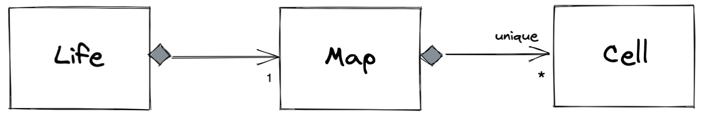

# Game of Life

## Summary
This is my solution to [BBC Game of Life technical challenge](docs/Game+of+Life+Candidate+Instructions.md).

## Installation

## Execution

## Narrative

Approach
1. Search internet for successful and unsuccessful approaches and take inspiration from them
1. Create a skeleton starting point, check into Github, submit link to assessor
1. Iterate on scenarios, committing to Github often, create release points for each successful scenario
1. Document and publish

After searching the internet, I realised these things:
- The grid size is "infinite" meaning my initial throughs of a two-dimensional array wouldn't work due to memory capacity
- There is no requirement to display the grid meaning I can focus on logic before presentation (if at all)
- I should build a solution attempting each scenario in turn, not all at once
- In attempting subsequent scenarios I could break working code for previous scenarios, and that a test driven development approach will be most useful here, something I've heard about but not utilised before, so this is my first attempt.

### Design

The Game of Life (Life) has a collection (Map) of live cells (Cell). We only need to consider live cells, as it is only live cells that affect evolution.

Here is a relationship diagram to visually describe my intended solution.

Life has one, and only one map, which is a collection of zero to many cells, which are all unique. A cell has metadata - its x and y coordinates. Ideally each Cell should be unique in the collection to avoid us performing unnecessary calculations. From my limited experience in Java I believe HashSet is suitable because it offers uniqueness and the uniqueness is implemented for us. However, there is no HashSet in JavaScript.

The collections available in JavaScript are Array, Map and Set. 

 - [Array](https://developer.mozilla.org/en-US/docs/Web/JavaScript/Reference/Global_Objects/Array) - does not afford uniqueness
 - [Set](https://developer.mozilla.org/en-US/docs/Web/JavaScript/Reference/Global_Objects/Set) - affords uniqueness but only for primitives not objects
 - [Map](https://developer.mozilla.org/en-US/docs/Web/JavaScript/Reference/Global_Objects/Map) - affords uniqueness for objects

I will use a Map.

