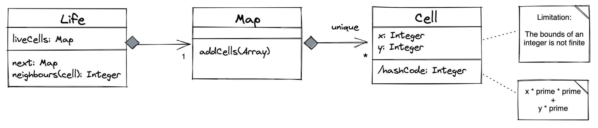

# Game of Life

## Summary
This is my solution to [BBC Game of Life technical challenge](docs/Game+of+Life+Candidate+Instructions.md).

## Installation
    npm install

## Execution
    npm run test
Without an explicit instruction to provide visual output I chose to focus on logic alone. Assuming my tests are sufficient, a suite of passing tests is an indicator of success.

## Narrative

### Approach
1. Search internet for successful and unsuccessful approaches and take inspiration from (not copy!) them
1. Create a skeleton starting point, check into Github, submit link to assessor
1. Iterate on scenarios, committing to Github often
1. Document 

After searching the internet, I realised these things:
- The grid size is "infinite" meaning my initial throughs of a two-dimensional array wouldn't work due to memory capacity
- There is no requirement to display the grid meaning I can focus on logic before presentation (if at all)
- I should build a solution attempting each scenario in turn, not all at once
- In attempting subsequent scenarios I could break working code for previous scenarios, and that a test driven development approach will be most useful here, something I've heard about but not utilised before, so this is my first attempt.

### Design

The Game of Life (Life) has a collection (Map) of live cells (Cell). We only need to consider live cells, as it is only live cells that affect evolution.

Here is a relationship diagram to visually describe my intended solution.

Life has one, and only one map, which is a collection of zero to many cells, which are all unique. A cell has metadata - its x and y coordinates. Ideally each Cell should be unique in the collection to avoid us performing unnecessary calculations. From my limited experience in Java I believe HashSet is suitable because it offers uniqueness and the uniqueness is implemented for us. However, there is no HashSet in JavaScript.

The collections available in JavaScript are Array, Map and Set. 

 - [Array](https://developer.mozilla.org/en-US/docs/Web/JavaScript/Reference/Global_Objects/Array) - does not afford uniqueness
 - [Set](https://developer.mozilla.org/en-US/docs/Web/JavaScript/Reference/Global_Objects/Set) - affords uniqueness but only for primitives not objects
 - [Map](https://developer.mozilla.org/en-US/docs/Web/JavaScript/Reference/Global_Objects/Map) - affords uniqueness for objects

I will use a Map.

Map uses (`key`, `value`) pairs. To uniquely store a Cell each `key` needs to be unique. The uniqueness can be obtained from the Cell `x` and `y` properties, but to differentiate between `(0,1)` and `(1,0)` it needs a calculated hash that distinguishes between `x` and `y`. I will follow other approaches on the internet to multiply the properties by small prime numbers and add together to make a hash. 

Here's an entity relationship diagram showing a bit more detail. `Life` has one `Map` which has zero or more `Cell`. A `Cell` identifies itself by holding its `x` and `y` properties, and surfaces a `hashCode()` method based on a calculation on those properties.

 

The challenge asks for an "infinite" two-dimensional grid, and by using `Integer` type for `x` and `y` positions this has a limitation of the size of `Integer` but presumably that's sufficient for this approach.

### Reflection

Post-implementation, I am now reflecting on my approach and my solution.

Scenarios 0 to 4 were achievable with a simple `true`/`false` switch on number of neighbours which I implemented in `isCellSurvivable()`. Only Scenario 0 asks for an evolution. The remainder of my solution was based on the premise that this approach is sound. Only when I implemented the final line of code did I realise that `isCellSurvivable()` is not used. I now wonder if this is the learning outcome I was expected to experience, and should I instead question my approach. (I now wonder if my "house of cards" is about to fall down, but I *think* my tests are trustable). Following a short period of thinking time, I returned to the code and modified `isCellSurvivable()` to also test non-live cells in https://github.com/HttpsOlly/game-of-life/pull/1.

Also, before starting to implement I did believe that uniqueness in Map needed me to write an `equals()` method because `Map` doesn't come with one, so I wrote one based on the hash approach, but removed it from the final implementation as it isn't needed.

This was my first time with test driven development. I have learned that if I can write reliable tests, then I have more confidence in writing code, safe in the knowledge that my tests have my back. 
